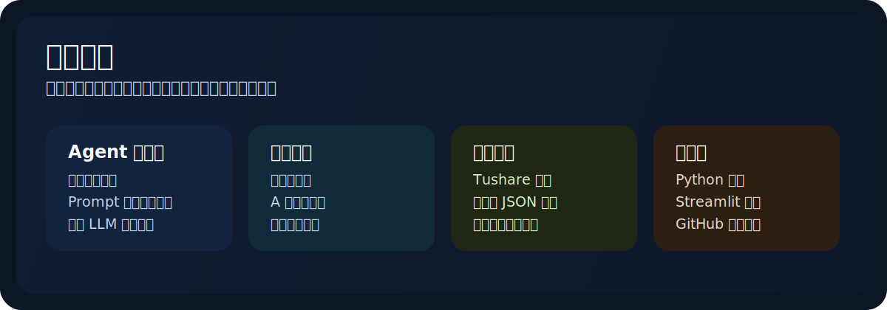

# 你好，我是 Xinpipi

我专注于把投资研究思路做成可以本地运行、可以演示、也可以持续迭代的软件项目。

最近一段时间，我主要在做这几类方向：

- 多智能体投研工作流
- 量化分析与事件驱动选股工具
- 可本地运行、可复用、可展示的研究产品
- 把研究逻辑沉淀成更像软件系统的项目

## 技术方向

| 方向 | 工具与特点 |
|---|---|
| 编程与脚本 | Python 为主，偏重实用型脚本与数据处理 |
| 数据与投研 | Tushare、结构化 JSON 输出、可复用研究流程 |
| LLM 系统 | DeepSeek 驱动的 Agent、Prompt 工作流、推理链路设计 |
| 产品层 | Streamlit 应用、本地工具、面向 GitHub 展示的项目包装 |

## 作品概览

| 类别 | 我在做什么 |
|---|---|
| 多智能体系统 | 概念选股、宏观事件解读、组合构建等投研 Agent 系统 |
| 量化工具 | 回测、个股分析、行业轮动、市场复盘流水线 |
| 可运行产品 | 可本地演示、可持续迭代的 Python / Streamlit 工具 |
| 研究基础设施 | 把临时分析流程沉淀成可复用项目结构和工作流 |

## 代表项目

| 项目 | 项目价值 | 技术栈 |
|---|---|---|
| [宏观热点选股 Agent](https://github.com/xinpipi-ai/macro-hotspot-agent) | 把宏观事件转成 A 股组合的多智能体系统，包含行业映射、风险校验与加权回测 | Python, Tushare, DeepSeek |
| [概念选股 Agent](https://github.com/xinpipi-ai/concept-stock-agent) | 把概念主题拆成产业链节点，再生成候选股票与组合回测结果 | Python, Tushare, DeepSeek |
| [Timepoint Rotation](https://github.com/xinpipi-ai/timepoint-rotation) | 面向行业轮动和日常市场复盘的研究仓库，强调数据驱动与可重复工作流 | Python, Tushare, iFinD MCP |
| [AI 量化工具](https://github.com/xinpipi-ai/ai-quant-tool) | 可直接运行的量化分析应用，支持回测、指标分析与 AI 辅助解读 | Python, Streamlit, yfinance |

## 其他项目

- [AI 量化研究助手](https://github.com/xinpipi-ai/ai-quant-assistant-project)
  面向因子研究和事件驱动选股的交互式 AI 投研原型。
- [AI Finance Demo](https://github.com/xinpipi-ai/ai-finance-demo)
  用于演示 AI 辅助研报阅读、财务诊断和资讯解读的 Streamlit 项目。
- [美林时钟可视化看板](https://github.com/xinpipi-ai/merrill-clock-dashboard)
  将宏观周期和大类资产配置逻辑可视化的前端项目。
- [会议纪要分析工作台](https://github.com/xinpipi-ai/minutes-analyzer-workbench)
  把会议纪要和通话记录转成结构化研究摘要的本地工具。

## 我想持续做的方向

- 做出更像正式作品集的项目，而不只是一次性脚本
- 让每个仓库都具备更清晰的 README 和展示方式
- 沉淀更多可以复用的投研 Agent 工作流
- 形成一套把金融研究经验和软件工程能力结合起来的项目体系

## 当前在做

- 持续发布端到端可运行的研究系统
- 提升代码质量、文档质量和项目包装
- 让每个仓库更接近真正可展示的产品，而不是原型

## GitHub 统计

  
  

## 说明

这里的大部分项目都来自真实需求和持续迭代。
我希望把它们持续打磨成更完整、更稳定、也更适合长期展示的作品。
