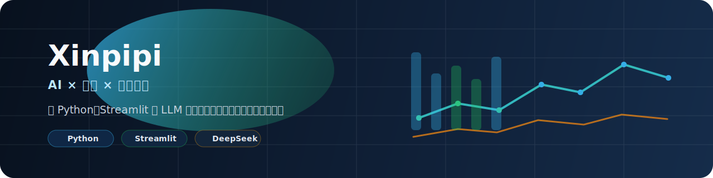

# Hi, I'm Xinpipi

I'm transitioning from investment research and tooling into a more formal software engineering path.

Right now, I mainly focus on:

- AI-powered research workflow prototypes
- Quant research and strategy tools
- Multi-agent investment research systems
- Local, runnable products built with Python and Streamlit
- Turning real-world needs into projects that can be demonstrated, reused, and iterated on

## GitHub Stats

  
  

## Featured Projects

| Project | What it does | Stack |
|---|---|---|
| [Macro Hotspot Agent](https://github.com/xinpipi-ai/macro-hotspot-agent) | A runnable multi-agent system for turning macro events into weighted A-share portfolios with sector mapping, risk review, and backtesting | Python, Tushare, DeepSeek |
| [Concept Stock Agent](https://github.com/xinpipi-ai/concept-stock-agent) | A multi-agent concept investing workflow that decomposes industry chains, selects candidate stocks, and builds backtested theme baskets | Python, Tushare, DeepSeek |
| [Timepoint Rotation](https://github.com/xinpipi-ai/timepoint-rotation) | Quant industry rotation research and AI-powered daily market recap using Tushare, iFinD MCP, and DeepSeek | Python, Tushare, DeepSeek |
| [AI Quant Tool](https://github.com/xinpipi-ai/ai-quant-tool) | A runnable quant analysis app with backtesting, AI signal interpretation, and A-share support including ChiNext tickers | Python, Streamlit, yfinance |
| [AI Quant Assistant Project](https://github.com/xinpipi-ai/ai-quant-assistant-project) | An interactive AI quant research dashboard for factor analysis and event-driven stock idea generation | Python, Streamlit, LLM |

## More Projects

- [AI Finance Demo](https://github.com/xinpipi-ai/ai-finance-demo)
  A Streamlit demo for AI-assisted report reading, financial diagnostics, and news interpretation.
- [Merrill Clock Dashboard](https://github.com/xinpipi-ai/merrill-clock-dashboard)
  An interactive front-end project that turns macro cycle and asset allocation ideas into a visual dashboard.
- [Minutes Analyzer Workbench](https://github.com/xinpipi-ai/minutes-analyzer-workbench)
  A local workbench for turning meeting minutes and call notes into structured research summaries.

## Investment Research Systems

- [Macro Hotspot Agent](https://github.com/xinpipi-ai/macro-hotspot-agent)
  Event-driven stock selection from macro narratives to `core / satellite / hedge` portfolios, with explicit risk-checking and weighted backtests.
- [Concept Stock Agent](https://github.com/xinpipi-ai/concept-stock-agent)
  Theme-driven stock selection that breaks a concept into industry-chain nodes, expands candidate names in parallel, and turns the result into a backtested basket.
- [Timepoint Rotation](https://github.com/xinpipi-ai/timepoint-rotation)
  A broader research workflow around market recap, rotation thinking, and data-powered daily investment research.

## What I'm Learning

- How to turn research workflows into clearer product modules
- How to make code, README files, and GitHub presentation feel more like real software projects
- How to design better agent workflows instead of isolated scripts
- How to grow from “someone who builds tools” into “someone who consistently ships products”

## Right Now

- Shipping more runnable products from concrete ideas
- Improving code quality, documentation, and portfolio presentation
- Building investment research tools while growing into a stronger software developer
- Making my GitHub profile reflect the systems I am actually building

## Notes

Most of the projects here come from real needs and iterative development.
My goal is not just to make them work, but to gradually turn them into stronger, more professional, and more representative pieces of work.
